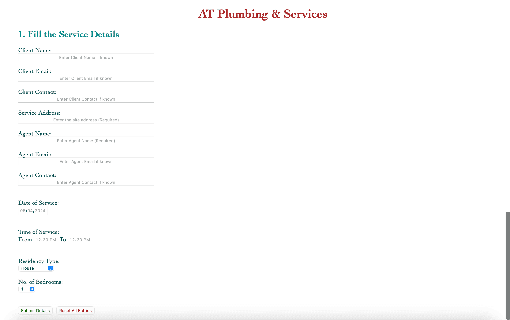
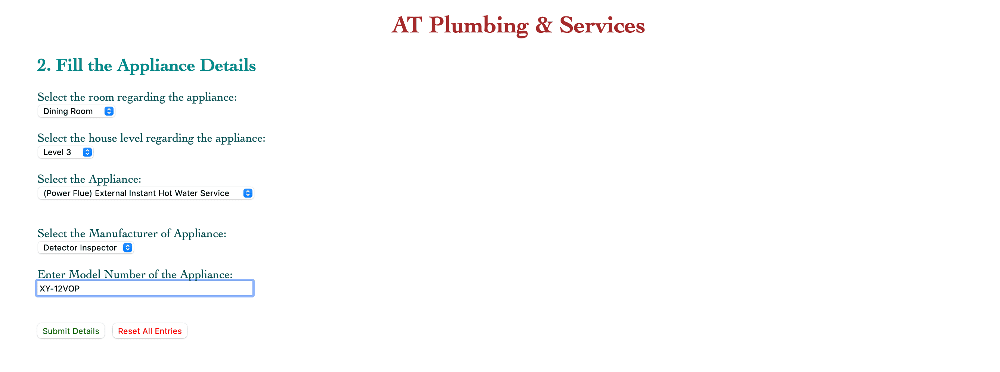
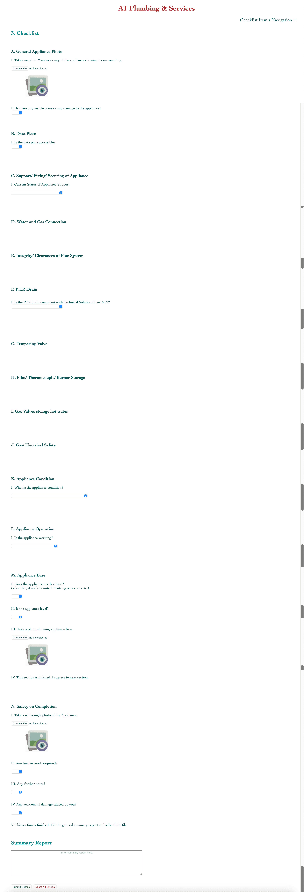
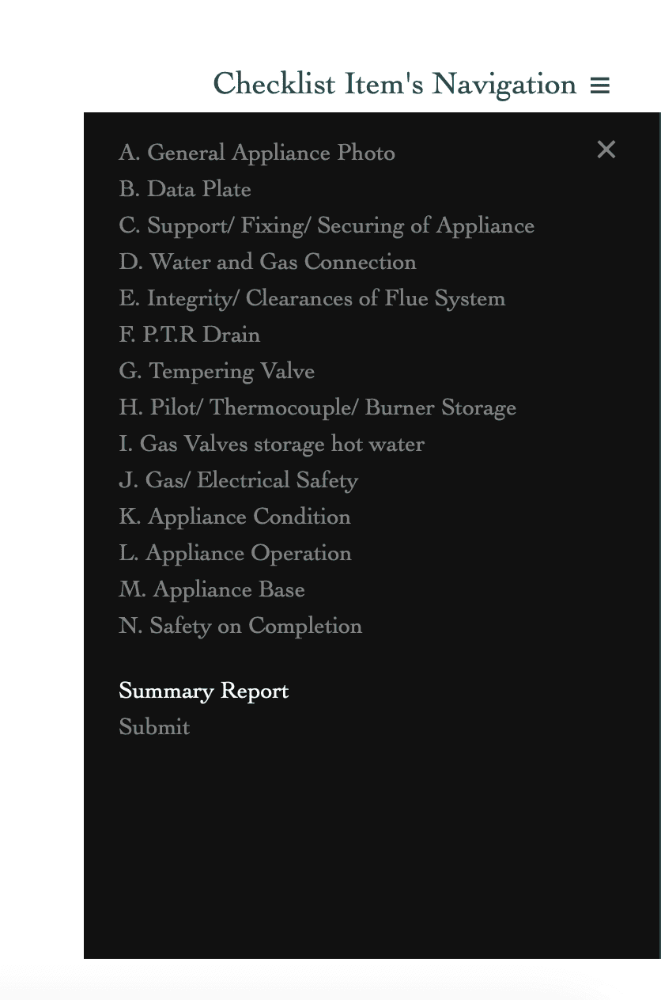

# AT Plumbing & Services

This project is a web application built with HTML, CSS, PHP, JavaScript, and phpMyAdmin (MySQL). It is designed to assist plumbers in storing and managing details found during a plumbing service. The application is divided into three sections: Service Details, Appliance Details, and Checklist. The user can navigate between these sections using the navigation bar at the top of the page.

## Features

- **Appliance Details**: The application allows the user to fill in details about the appliance in a specific room. This is implemented in `appliance.php`.

- **Checklist**: The application provides a comprehensive checklist for the plumber to follow during a service. This is implemented in `checklist.php`.

- **Image Uploads**: The application allows the user to upload images at various stages of the checklist. This is handled by JavaScript functions in `image_preview.js` and `show_hidden.js`.

## Demo

Here are some screenshots of the application:

### Service Details

### Appliance Details

### Checklist

### Navigation for Checklist

## Setup

To set up this project, you need to have a server environment like XAMPP or WAMP. Clone the repository into the htdocs or www directory of your server environment. Start the Apache and MySQL modules, and navigate to the project in your web browser.

## Database

The text data is stored in phpMyAdmin, while images are stored in a folder. Using BLOB to store in the database would cost performance.

## Contributing

Pull requests are welcome. For major changes, please open an issue first to discuss what you would like to change.

## License

This project is licensed under the MIT License.